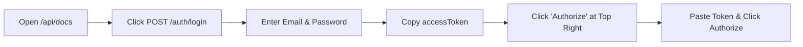
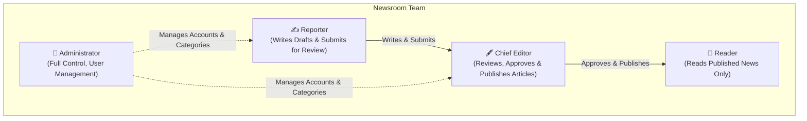
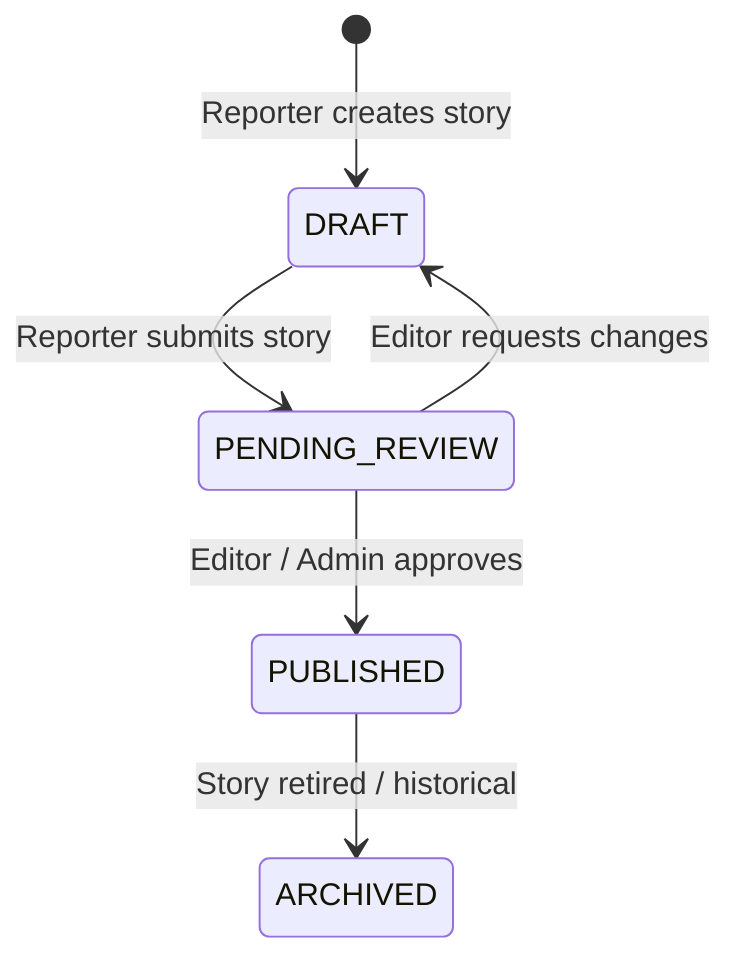

# 📰 News Portal - Administrator & Editorial Guide
*A step-by-step guide for newsroom editors, managers, and portal administrators.*

---

## 🌟 Welcome to the News Portal!

This guide explains how to manage your news portal without needing any programming knowledge. You will learn how to:
- Log in and secure your administrator account
- Add and manage newsroom staff (Reporters, Editors, Administrators)
- Organize news categories and topics (Taxonomy)
- Run the newsroom editorial pipeline (Drafting ➡️ Reviewing ➡️ Publishing)
- Feature breaking news and top headlines
- Upload images and media
- Check system status and troubleshoot common questions

---

## 1. Getting Started & Logging In

### Accessing the Portal
Your backend provides a visual API portal (Swagger Documentation) where you can test and perform administrative actions:
- **Interactive Portal URL**: `http://localhost:3000/api/docs` *(or your company web address)*

### Default Administrator Credentials
When the system is first started, a master administrator account is automatically ready for you:

> [!IMPORTANT]
> **Initial Login Details:**
> - **Email**: `admin@newsportal.com`
> - **Password**: `AdminPassword123!`



### Steps to Log In:
1. Open `http://localhost:3000/api/docs` in your web browser.
2. Scroll to the **Auth** section and click `POST /auth/login`.
3. Click **Try it out** and enter your administrator email and password.
4. Click **Execute**. The system will return a long security code called `accessToken`.
5. Copy this token. Scroll to the top right of the page and click the green **Authorize 🔓** button.
6. Paste your token into the box and click **Authorize**. You are now logged in!

> [!TIP]
> **Change Your Password Early**: To protect your newsroom, create your own personal administrator account or update your password as soon as possible.

---

## 2. Understanding Team Roles & Permissions

Every team member has a specific role to ensure news quality and editorial accountability:



### Roles Breakdown:

| Role | What They Can Do |
| :--- | :--- |
| **👑 Administrator** | Full control: Can create accounts, change roles, delete users, create news categories, publish articles, and check system health. |
| **🖋️ Chief Editor** | Editorial authority: Can review articles submitted by reporters, edit content, approve and publish articles to the live website, and manage categories. |
| **✍️ Reporter** | Content creator: Can write new stories, save drafts, and submit stories for review. *Reporters cannot publish articles directly to the live site.* |
| **👥 Reader** | Public audience: Can view published news stories, filter by category or tag, and read articles. |

---

## 3. Managing Newsroom Staff (User Management)

*Only Administrators can create or remove staff members.*

### How to Add a New Reporter or Editor:
1. In the portal, navigate to the **Users** section and select `POST /users`.
2. Click **Try it out**.
3. Fill in the team member's details:
   ```json
   {
     "email": "sarah.johnson@newsportal.com",
     "password": "TemporaryPassword123!",
     "firstName": "Sarah",
     "lastName": "Johnson",
     "role": "REPORTER"
   }
   ```
   *(Roles can be `REPORTER`, `CHIEF_EDITOR`, or `ADMIN`)*
4. Click **Execute**. The new staff member can now log in using their email and password.

> [!NOTE]
> All passwords must be at least **8 characters** long.

---

## 4. Organizing Content: Categories & Tags

Before writing articles, set up your news sections so readers can easily browse topics.

### Categories (Main News Sections)
Categories are the primary navigation sections of your news portal (e.g., *Politics*, *Business*, *Technology*, *Sports*, *Entertainment*).

- **Create a Category**: Go to `POST /categories` and provide:
  - `name`: e.g. `"World News"`
  - `description`: A brief summary of the section
  - `orderIndex`: A number (1, 2, 3...) to control the order on the navigation menu
- **Subcategories (Hierarchical)**: You can link a category to a parent category (e.g., *Premier League* under *Sports*) by providing the `parentId`.

### Tags (Topics & Keywords)
Tags are specific keywords attached to stories (e.g., `#AI`, `#Elections2026`, `#Olympics`).
- You don't need to create tags in advance! When reporters write stories, any tags they enter are automatically created by the system.

---

## 5. The Editorial Pipeline: Writing & Publishing News

To maintain journalistic integrity, your news portal uses an editorial review workflow:



### Stage 1: Creating a Draft (Reporter or Editor)
1. Navigate to `POST /articles`.
2. Enter the story details:
   - `title`: The headline (e.g., `"Major Breakthrough in Renewable Solar Energy"`)
   - `content`: The full body of the story
   - `summary`: A short 1-2 sentence preview for search engines and social cards
   - `categoryId`: The ID of the category it belongs to
   - `tags`: List of topics, e.g. `["Solar", "Energy", "Climate"]`
3. Click **Execute**. The story is saved as a **`DRAFT`**. It is **not** visible to the public.

> [!TIP]
> **Automatic Web Links (Slugs)**: You never need to write web links manually. The system automatically creates clean, search-engine-friendly URLs from your headline (e.g. `/articles/major-breakthrough-in-renewable-solar-energy-x92a`).

---

### Stage 2: Submitting for Review (Reporter)
Once the reporter finishes writing:
1. Go to `PATCH /articles/{id}/status`.
2. Enter the article ID.
3. In the body, set:
   ```json
   {
     "status": "PENDING_REVIEW"
   }
   ```
4. Click **Execute**. The story is now awaiting review on the Chief Editor's desk.

---

### Stage 3: Editorial Approval & Publishing (Chief Editor or Admin)
The Chief Editor reviews the story for accuracy, spelling, and quality:
1. Go to `PATCH /articles/{id}/status`.
2. To publish the story to the live website:
   ```json
   {
     "status": "PUBLISHED"
   }
   ```
3. Click **Execute**. The story is now live for all readers! The publication timestamp is automatically recorded.

> [!CAUTION]
> If a Reporter tries to set status to `PUBLISHED`, the system will block the action with a **`403 Forbidden`** error. Only Chief Editors and Administrators can approve and publish stories.

---

## 6. Breaking News & Featured Headlines

You can highlight important stories directly on the front page:

### 🚨 Breaking News Ticker
- When creating or editing an article, set `"isBreaking": true`.
- The story will instantly appear in the **Breaking News** ticker bar at the top of the portal.
- Fast-cached for immediate delivery to thousands of simultaneous readers.

### ⭐ Featured Top Stories
- Set `"isFeatured": true` to display the story in the hero carousel or main banner on the homepage.

---

## 7. Media & Photo Management

Every news article needs engaging imagery:

### Uploading Photos
1. Navigate to `POST /media/upload`.
2. Select an image file from your computer.
   - **Supported formats**: JPG, JPEG, PNG, WebP, GIF.
   - **Max file size**: 5 MB.
3. Add a descriptive caption (e.g., `"Solar panel installation in Texas"`).
4. Click **Execute**. The system saves the image and gives you a `url` (e.g. `/uploads/1726747200-solar.jpg`).
5. Copy this URL and paste it as the `featuredImageUrl` when writing your article.

---

## 8. Checking Portal Health (Monitoring)

You can easily check if your news website is running smoothly without calling a developer:

| Check URL | What to Look For | Meaning |
| :--- | :--- | :--- |
| `GET /health/live` | `"status": "ok"` | The server software is running and responsive. |
| `GET /health/ready` | `"status": "ok"` | The database and Redis cache are connected and ready to serve readers. |
| `GET /health` | Detailed report | Displays server uptime (in seconds) and response times. |

> [!NOTE]
> If `/health/ready` ever shows `"status": "degraded"`, the news portal is still operating and serving news directly from the database, but the fast cache is restarting.

---

## 9. Frequently Asked Questions (FAQ)

### Q: An article was published by mistake. How do I unpublish it quickly?
**A:** Go to `PATCH /articles/{id}/status` and change the status back to `"DRAFT"` or `"ARCHIVED"`. The story will immediately disappear from the public website.

### Q: Why did a reporter get an error when trying to publish?
**A:** By design, reporters can only submit stories for review (`PENDING_REVIEW`). A Chief Editor or Administrator must approve and publish it.

### Q: How do view counters work?
**A:** Every time a reader visits an article page, the system automatically counts the view in the background without slowing down the reader's page load.

### Q: Where are uploaded pictures stored?
**A:** All photos are stored securely in the portal's `/uploads` folder and served directly to web and mobile readers.

---

*Manual prepared for News Portal Editorial and Administrative Staff. Powered by NestJS, PostgreSQL 18 & Redis.*
