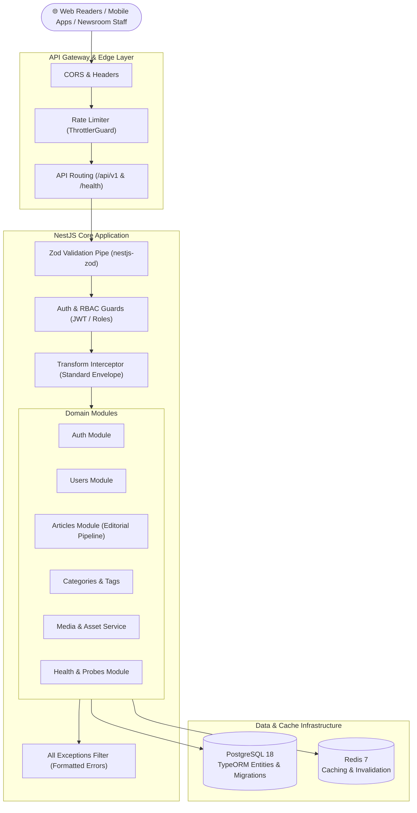

# 📰 News Portal Backend API

[](https://nodejs.org/)
[](https://nestjs.com/)
[](https://www.typescriptlang.org/)
[](https://www.postgresql.org/)
[](https://redis.io/)
[](https://zod.dev/)
[](LICENSE)

An enterprise-grade, high-concurrency News Portal Backend engineered for modern digital newsrooms and publishing platforms. Built with **NestJS 11 (TypeScript Strict Mode)**, **PostgreSQL 18** (TypeORM), **Redis 7** (In-Memory Cache & Throttler), **Role-Based Access Control (RBAC)**, and pure **Zod Schema Validation**.

---

## 📑 Table of Contents

- [Architecture Overview](#-architecture-overview)
- [Enterprise Features](#-enterprise-features)
- [Tech Stack](#-tech-stack)
- [Environment Configuration](#-environment-configuration)
- [Quick Start (Local Development)](#-quick-start-local-development)
- [Database Migrations & CLI](#-database-migrations--cli)
- [Testing & Quality Assurance](#-testing--quality-assurance)
- [Health Monitoring & Probes](#-health-monitoring--probes)
- [API Reference & OpenAPI](#-api-reference--openapi)
- [Production Deployment Runbook](#-production-deployment-runbook)
- [Staff & Admin Documentation](#-staff--admin-documentation)

---

## 🏛 Architecture Overview



---

## 🌟 Enterprise Features

### 1. Robust Editorial Pipeline (RBAC)
- **4 Granular Roles**: `ADMIN`, `CHIEF_EDITOR`, `REPORTER`, `READER`.
- **4-Stage Article Lifecycle**: `DRAFT` ➡️ `PENDING_REVIEW` ➡️ `PUBLISHED` ➡️ `ARCHIVED`.
- **Strict Role Enforcement**: Reporters can author and submit drafts but cannot self-publish. Chief Editors and Admins review, approve, publish, and schedule stories.
- **Breaking News & Top Stories**: Dedicated flags (`isBreaking`, `isFeatured`) with fast, prioritized query channels.
- **Search-Engine Optimized URLs**: Unique, auto-generated URL slugs created from headlines on the fly.

### 2. High-Throughput Redis 7 Caching
- **Sub-Millisecond Read Latency**: Category navigation tree (`categories:tree`), breaking news headlines (`articles:breaking:*`), and top featured stories (`articles:featured:*`) cached in-memory.
- **Targeted Cache Invalidation**: Automated tag-based cache eviction triggers when articles are published, updated, or archived.
- **Non-Blocking View Metrics**: Asynchronous view counter increments run without blocking reader request threads.
- **Fault-Tolerant Cache Fallback**: In the event of Redis downtime, the application seamlessly fails over to direct database queries without dropping traffic.

### 3. Pure Zod Schema & Environment Validation
- **Single Source of Truth**: All DTOs, parameters, and environment variables are defined via Zod schemas.
- **Fail-Fast Startup**: Environment variables are strictly validated and coerced (`validateEnv`) before any service boots.
- **Type-Safe Injections**: `ConfigService<EnvConfig, true>` guarantees zero runtime `undefined` configurations and eliminates redundant fallback code.
- **Clean Error Envelopes**: Global exception filter catches Zod validation failures and maps them to clean, field-level JSON error messages.

### 4. Cloud-Native Health & Monitoring Probes
- **`/health/live` (Liveness)**: Validates Node.js event loop health and memory consumption. Decoupled from external databases to avoid container restart loops.
- **`/health/ready` (Readiness)**: Probes PostgreSQL 18 (`SELECT 1`) and Redis 7 (`PING` -> `PONG`) with latency in milliseconds. Returns HTTP `503` if the database is unreachable, instructing load balancers to route traffic away.
- **Rate-Limit & Auth Exemption**: Annotated with `@Public()` and `@SkipThrottle()`, and excluded from global prefixes for Kubernetes / AWS ALB compliance.

---

## 🛠 Tech Stack

| Component | Technology | Version | Description |
| :--- | :--- | :--- | :--- |
| **Framework** | NestJS | `^11.0.1` | Enterprise Node.js framework in TypeScript strict mode |
| **Language** | TypeScript | `^5.9.3` | Strongly-typed JavaScript with isolatedModules enabled |
| **Database** | PostgreSQL | `18-alpine` | High-performance relational database |
| **ORM** | TypeORM | `^0.3.20` | Data Mapper pattern with code migrations |
| **Cache & Store** | Redis | `7-alpine` | Ultra-fast in-memory cache layer via `ioredis` |
| **Validation** | Zod / nestjs-zod | `^3.24.1` / `^5.5.0` | Declarative schema validation and DTO inference |
| **Security** | Passport JWT / bcryptjs | `^0.7.0` / `^3.0.2` | Access tokens (1h), salted password hashing |
| **Rate Limiter** | `@nestjs/throttler` | `^6.4.0` | Sliding-window brute force protection |
| **API Docs** | Swagger OpenAPI | `^11.0.3` | Interactive documentation UI and OpenAPI JSON spec |
| **Test Engine** | Jest / Supertest | `^29.7.0` | Unit testing and E2E HTTP integration testing |

---

## ⚙️ Environment Configuration

Configuration is managed through environment files with the loading priority:
1. `.env.local` *(Local developer overrides - Git ignored)*
2. `.env` *(Deployment environment configuration)*
3. `.env.example` *(Reference template)*

### Schema Definition & Reference

| Variable | Type | Default | Description | Production Guidance |
| :--- | :--- | :--- | :--- | :--- |
| `PORT` | `number` | `3000` | Application HTTP listening port | Bind to `3000` or port assigned by cloud runner |
| `NODE_ENV` | `enum` | `development` | Environment mode (`development`, `production`, `test`) | Set to `production` |
| `API_PREFIX` | `string` | `api/v1` | URL prefix for business endpoints | Keep `api/v1` |
| `DB_HOST` | `string` | `localhost` | PostgreSQL 18 hostname | RDS / Cloud SQL / Cluster hostname |
| `DB_PORT` | `number` | `5432` | PostgreSQL 18 port | Default `5432` |
| `DB_USERNAME` | `string` | `postgres` | Database user | Use dedicated application user |
| `DB_PASSWORD` | `string` | `postgres` | Database password | Strong, generated secret |
| `DB_DATABASE` | `string` | `news_portal_db`| Database name | Production database name |
| `DB_SYNCHRONIZE`| `string` | `true` | TypeORM entity sync | **Must be `false` in production** (use migrations) |
| `DB_LOGGING` | `string` | `false` | SQL query logging | Set `false` in production for performance |
| `REDIS_HOST` | `string` | `localhost` | Redis 7 hostname | ElastiCache / Redis Cloud endpoint |
| `REDIS_PORT` | `number` | `6379` | Redis 7 port | Default `6379` |
| `REDIS_TTL_SECONDS`| `number` | `300` | Default cache TTL (5 minutes) | Adjust per newsroom caching policy |
| `JWT_SECRET` | `string` | *(default key)* | Secret key for signing access tokens | **Must be generated with 256-bit entropy** |
| `JWT_EXPIRES_IN`| `string` | `1h` | Access token lifespan | `1h` or `15m` |
| `THROTTLE_TTL` | `number` | `60000` | Rate limiter window (ms) | Default 60 seconds |
| `THROTTLE_LIMIT`| `number` | `100` | Max requests per window | Adjust based on traffic volume |
| `UPLOAD_DEST` | `string` | `./uploads` | Disk storage directory for media assets | Mount persistent storage volume |
| `MAX_FILE_SIZE_MB`| `number`| `5` | Maximum upload size in MB | Adjust per editorial photo standards |
| `ALLOWED_MIME_TYPES`| `string`| *(images)* | Comma-separated MIME filter | `image/jpeg,image/png,image/webp,image/gif` |
| `AUTO_SEED_ADMIN`| `boolean`| `true` | Auto-seed initial admin on bootstrap | Disable after initial deployment |
| `DEFAULT_ADMIN_EMAIL`| `string`| `admin@newsportal.com` | Initial admin account email | Change immediately after deployment |
| `DEFAULT_ADMIN_PASSWORD`| `string`| `AdminPassword123!` | Initial admin account password | Change immediately after deployment |

---

## 🚀 Quick Start (Local Development)

### 1. Prerequisites
- **Node.js** >= 20.x
- **Docker & Docker Compose**

### 2. Clone & Install Dependencies
```bash
git clone https://github.com/TechBugs25/news_portal_backend.git
cd news_portal_backend
npm install
```

### 3. Launch Database & Cache Services
```bash
# Starts PostgreSQL 18 & Redis 7 in detached mode
docker compose up -d
```

### 4. Configure Environment
```bash
cp .env.example .env.local
```

### 5. Run Database Migrations
```bash
npm run migration:run
```

### 6. Start the Development Server
```bash
npm run start:dev
```

The server will boot with live watch-reload:
- **API URL:** `http://localhost:3000/api/v1`
- **Swagger Documentation:** `http://localhost:3000/api/docs`
- **Liveness Probe:** `http://localhost:3000/health/live`
- **Readiness Probe:** `http://localhost:3000/health/ready`

---

## 🗄 Database Migrations & CLI

All database schema evolutions are managed strictly via TypeORM migrations:

```bash
# Execute all pending migrations
npm run migration:run

# Revert the last executed migration
npm run migration:revert

# Display status of all migrations
npm run migration:show

# Generate a new migration automatically from entity modifications
npm run migration:generate -- src/database/migrations/DescriptiveName

# Create a blank migration file for custom SQL operations
npm run migration:create -- src/database/migrations/ManualName
```

---

## 🧪 Testing & Quality Assurance

The codebase enforces strict quality gates across unit tests, E2E integration tests, and static linting:

```bash
# 1. Run Unit Tests (6 suites, 20 tests)
npm test

# 2. Run End-to-End Integration Tests (4 suites, 18 tests)
npm run test:e2e

# 3. Generate Code Coverage Report
npm run test:cov

# 4. Run TypeScript Strict Compilation Check (0 errors)
npx tsc --noEmit

# 5. Run ESLint Static Analysis
npm run lint

# 6. Run NestJS Production Bundle Build
npm run build
```

---

## 🩺 Health Monitoring & Probes

Designed for zero-downtime orchestration in Kubernetes, AWS ECS, or Docker Swarm.

### Liveness Probe (`GET /health/live` or `/health/liveness`)
```bash
curl -s http://localhost:3000/health/live
```
```json
{
  "success": true,
  "statusCode": 200,
  "data": {
    "status": "ok",
    "check": "liveness",
    "timestamp": "2026-09-19T09:30:57.541Z",
    "uptimeSeconds": 340,
    "memoryUsage": {
      "rssMb": 86.81,
      "heapTotalMb": 111.00,
      "heapUsedMb": 64.14
    }
  }
}
```

### Readiness Probe (`GET /health/ready` or `/health/readiness`)
```bash
curl -s http://localhost:3000/health/ready
```
```json
{
  "success": true,
  "statusCode": 200,
  "data": {
    "status": "ok",
    "check": "readiness",
    "timestamp": "2026-09-19T09:31:02.490Z",
    "services": {
      "database": {
        "status": "up",
        "type": "postgres-18",
        "latencyMs": 4
      },
      "redis": {
        "status": "up",
        "type": "redis-7",
        "latencyMs": 1
      }
    }
  }
}
```

---

## 📚 API Reference & OpenAPI

Explore, inspect, and test all endpoints interactively at **`/api/docs`**.

### Core Route Summary

| Method | Route | Access Level | Description |
| :--- | :--- | :--- | :--- |
| **POST** | `/api/v1/auth/register` | Public | Register a new Reader account |
| **POST** | `/api/v1/auth/login` | Public | Authenticate user & receive JWT Bearer token |
| **GET** | `/api/v1/users/me` | Authenticated | Retrieve current user profile |
| **GET** | `/api/v1/users` | Admin / Chief Editor | List all user accounts with pagination |
| **POST** | `/api/v1/users` | Admin | Provision staff accounts with specific roles |
| **GET** | `/api/v1/articles` | Public | Query published news articles (supports taxonomy, pagination, search) |
| **GET** | `/api/v1/articles/breaking` | Public (Redis Cached) | Top breaking news banner headlines |
| **GET** | `/api/v1/articles/featured` | Public (Redis Cached) | Homepage top featured stories |
| **GET** | `/api/v1/articles/:idOrSlug` | Public | Read full article & trigger non-blocking view increment |
| **POST** | `/api/v1/articles` | Reporter / Editor / Admin | Author new article draft (`DRAFT`) |
| **GET** | `/api/v1/articles/editorial/list`| Reporter / Editor / Admin | Filter editorial queue (`DRAFT`, `PENDING_REVIEW`, `PUBLISHED`) |
| **PATCH** | `/api/v1/articles/:id` | Reporter / Editor / Admin | Update article content / metadata |
| **PATCH** | `/api/v1/articles/:id/status`| Reporter / Editor / Admin | Update editorial status (submit for review, publish, archive) |
| **DELETE**| `/api/v1/articles/:id` | Admin / Chief Editor | Soft/hard delete article |
| **GET** | `/api/v1/categories` | Public (Redis Cached) | Hierarchical category navigation tree |
| **POST** | `/api/v1/categories` | Admin / Chief Editor | Create new category section |
| **GET** | `/api/v1/tags` | Public | Retrieve active taxonomy tags |
| **POST** | `/api/v1/media/upload` | Staff | Upload article photography & media assets |
| **GET** | `/health/live` | Public (Unthrottled) | Container liveness checkpoint |
| **GET** | `/health/ready` | Public (Unthrottled) | Database & Cache readiness checkpoint |

---

## 🏭 Production Deployment Runbook

### 1. Build Production Bundle
```bash
npm run build
```
This outputs an optimized, strictly-typed JavaScript bundle to `./dist`.

### 2. Production Environment Verification Checklist
- [ ] `NODE_ENV=production`
- [ ] `DB_SYNCHRONIZE=false` (Mandatory! Prevent data loss)
- [ ] `DB_LOGGING=false`
- [ ] Strong `JWT_SECRET` generated with at least 32 random characters
- [ ] Initial administrator password changed from default
- [ ] `AUTO_SEED_ADMIN=false` after first bootstrap
- [ ] Persistent storage volume mounted for `./uploads`

### 3. Production Process Management (PM2)

Create an `ecosystem.config.js` file:
```javascript
module.exports = {
  apps: [
    {
      name: 'news-portal-backend',
      script: 'dist/main.js',
      instances: 'max',
      exec_mode: 'cluster',
      autorestart: true,
      max_memory_restart: '1G',
      env: {
        NODE_ENV: 'production',
      },
    },
  ],
};
```
Start cluster:
```bash
pm2 start ecosystem.config.js
pm2 save
```

### 4. Kubernetes Probe Configuration
```yaml
livenessProbe:
  httpGet:
    path: /health/live
    port: 3000
  initialDelaySeconds: 15
  periodSeconds: 10
  timeoutSeconds: 3
  failureThreshold: 3

readinessProbe:
  httpGet:
    path: /health/ready
    port: 3000
  initialDelaySeconds: 5
  periodSeconds: 5
  timeoutSeconds: 3
  failureThreshold: 2
```

---

## 📖 Staff & Admin Documentation

For newsroom editors, reporters, and non-technical staff, refer to the complete, plain-language manual:
👉 **[Non-Technical Administrator & Editorial Manual (`ADMIN_MANUAL.md`)](ADMIN_MANUAL.md)**

---

## 📄 License

This project is licensed under the [MIT License](LICENSE).
